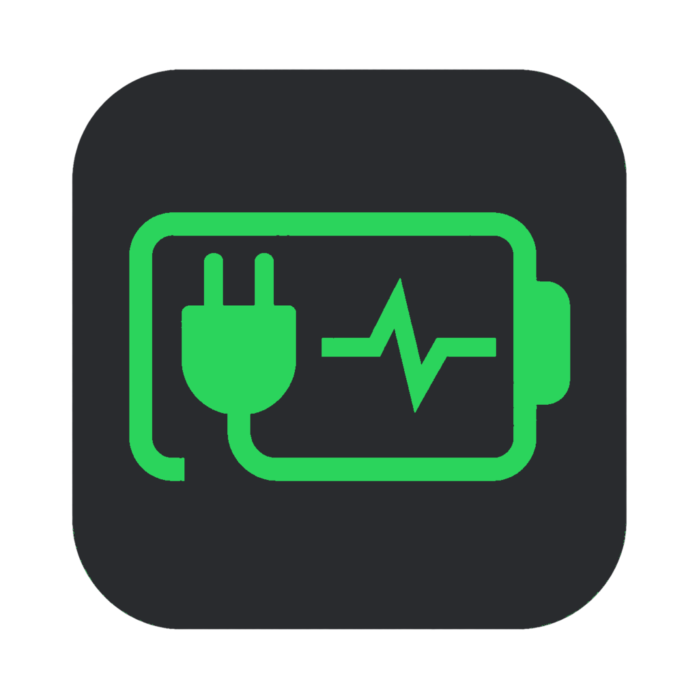

<p align="center">
  
</p>

<h1 align="center">Battery Menu</h1>

<p align="center">
  A native macOS menu bar monitor for battery health, power flow, and energy usage.
</p>

<p align="center">
  <strong>English</strong> · <a href="README.zh-CN.md">简体中文</a>
</p>

Battery Menu reads macOS hardware telemetry and presents it in a compact,
customizable menu bar panel. All data stays on your Mac. The app does not
connect to a server, change charging behavior, or require administrator access.

## Features

- Battery percentage, charging state, power source, temperature, health, and
  cycle count
- Adapter name, rated power, voltage, current, and live input power
- Separate adapter output, battery output, and estimated system load
- Persistent power history for the most recent 30 minutes
- Current high-energy apps estimated from the macOS `POWER` metric
- Configurable menu bar items: battery icon, percentage, temperature, and power
- Optional panel modules for charge, health, power, history, apps, and adapter
- System, light, and dark appearances with native macOS materials
- Native SwiftUI menu bar experience with no Dock icon

## Requirements

- macOS 13 Ventura or later
- Apple silicon or Intel Mac with battery telemetry exposed by macOS
- Swift 6 toolchain when building from source

Some hardware fields vary by Mac model and macOS version. Missing values are
shown as `—` instead of being estimated.

## Install

### Download a release

Download the latest package from
[GitHub Releases](https://github.com/985860612/battery-menu/releases), unzip it,
and move `Battery Menu.app` to `/Applications`.

Current release archives use an ad-hoc signature and are not Apple-notarized.
If macOS blocks the first launch, open **System Settings → Privacy & Security**
and explicitly allow the app.

### Build from source

```bash
git clone https://github.com/985860612/battery-menu.git
cd battery-menu
./scripts/build-app.sh
open "dist/Battery Menu.app"
```

The build script creates a Release binary, assembles the application bundle,
copies the app icon, and applies an ad-hoc signature.

## Usage

Launch the app, then select its battery item in the menu bar. Use the settings
button at the bottom of the panel to choose an appearance, enable or disable
panel modules, and configure the information shown in the menu bar.

Power history is stored locally at:

```text
~/Library/Application Support/Battery Menu/power-history.json
```

Use the trash button in the power chart to clear it.

## Data sources

| Data | macOS source | Notes |
| --- | --- | --- |
| Battery percentage and charging state | IOKit Power Sources API | Standard system power-source data |
| Temperature, cycles, adapter, and power | `AppleSmartBattery` in IORegistry | Availability and field names vary by hardware |
| Maximum capacity | `system_profiler -json SPPowerDataType` | Refreshed at a low frequency |
| High-energy apps | `/usr/bin/top` `POWER` samples + `/bin/ps` | A live estimate, not Activity Monitor's 12-hour history |

## Privacy

- No network requests
- No analytics or telemetry uploads
- No administrator privileges
- No charging-limit or power-management changes
- Only the 30-minute power chart is persisted locally

## Development

```bash
swift build
swift run battery-dump
swift run BatteryMenu
```

`battery-dump` prints the current raw snapshot and is useful when checking
hardware compatibility.

```text
Sources/BatteryCore/   Hardware readers, models, and local history
Sources/BatteryMenu/   Menu bar app, panel, settings, and charts
Sources/BatteryDump/   Command-line diagnostic tool
Resources/             App icon source and compiled macOS icon
Support/               Application bundle metadata
scripts/               Release app-bundle build script
```

See [CONTRIBUTING.md](CONTRIBUTING.md) before submitting a change.

## Known limitations

- Hardware telemetry relies on macOS interfaces that Apple does not keep
  identical across every Mac model.
- High-energy app values are short live samples and should not be compared
  directly with Activity Monitor's 12-hour energy column.
- Release archives are not yet signed with an Apple Developer ID or notarized.

## License

Battery Menu is available under the [MIT License](LICENSE).

Copyright (c) 2026 wangxiaojie
